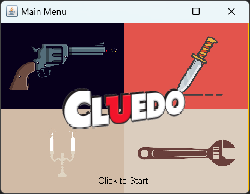
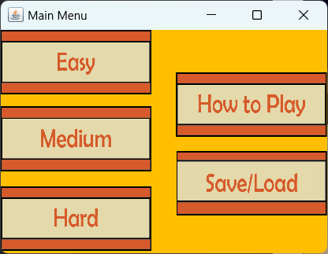
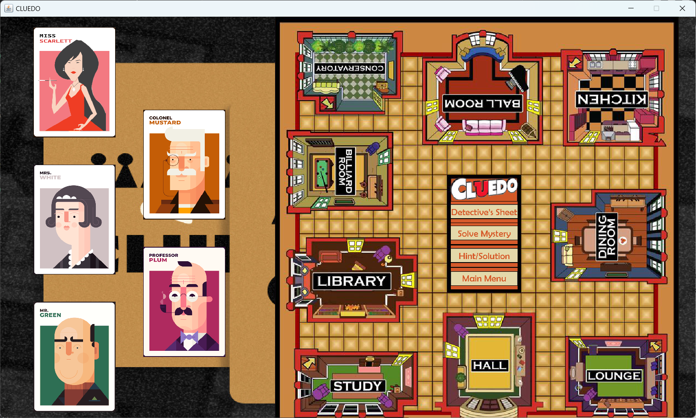
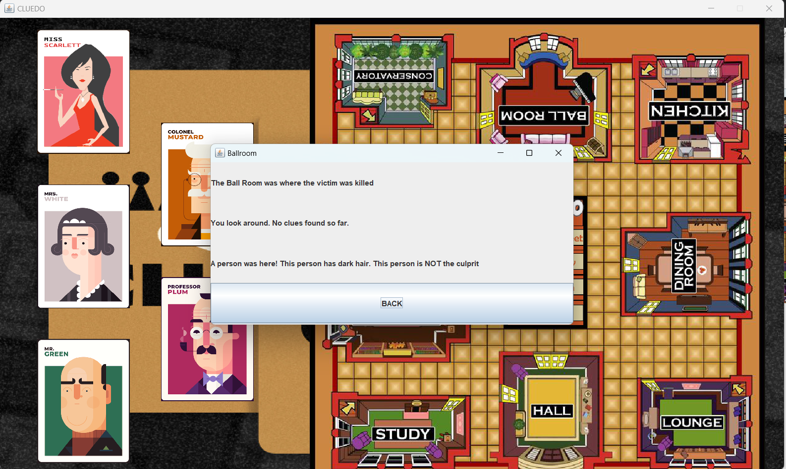
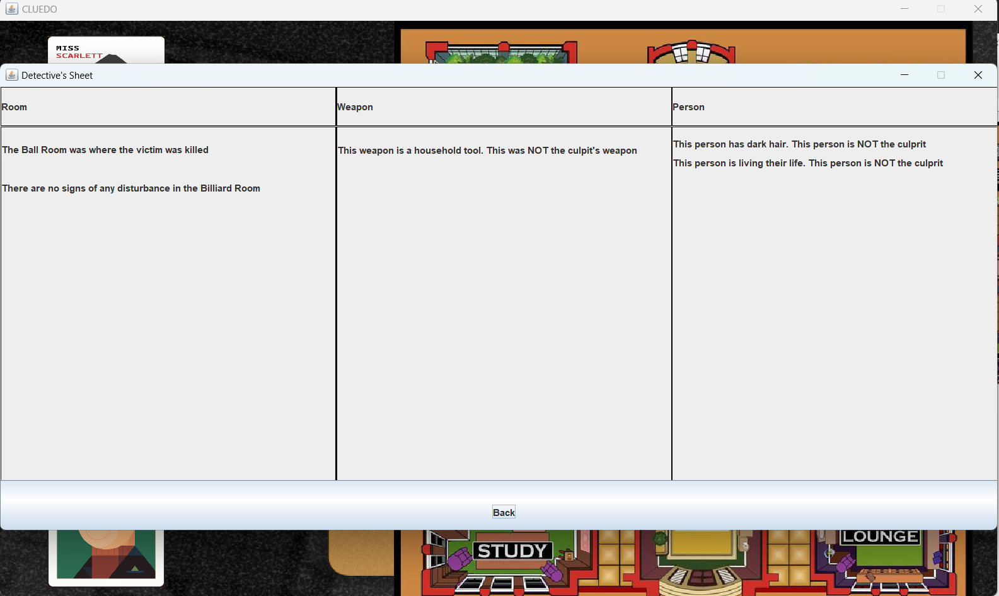
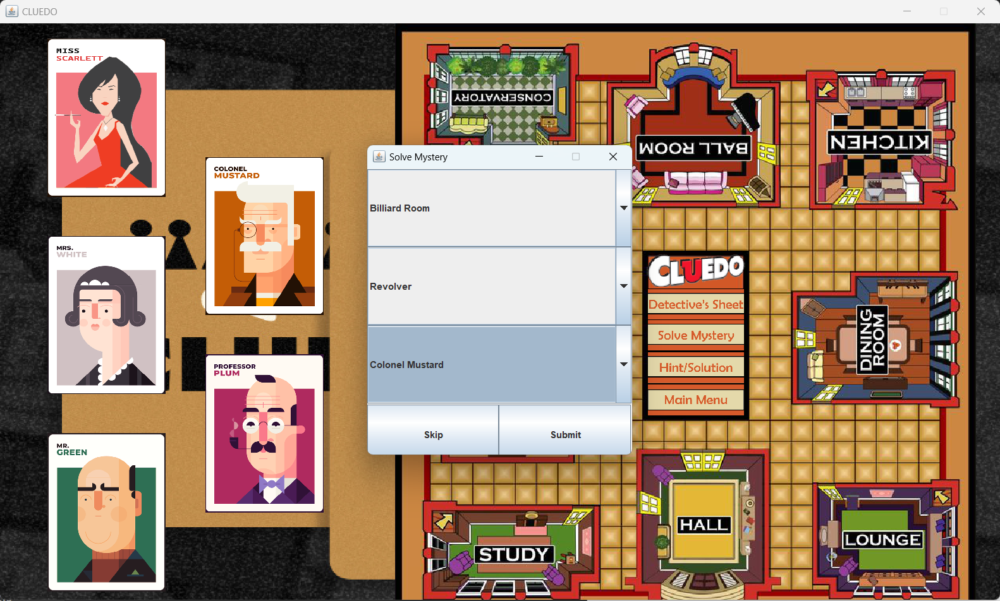
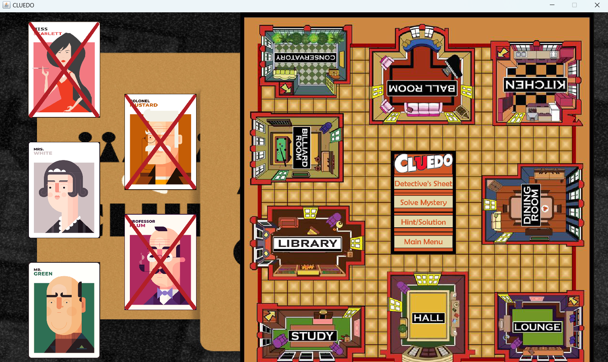
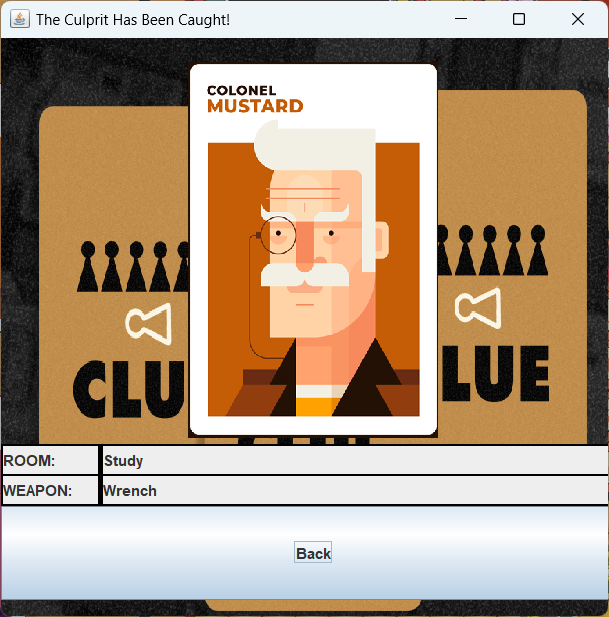
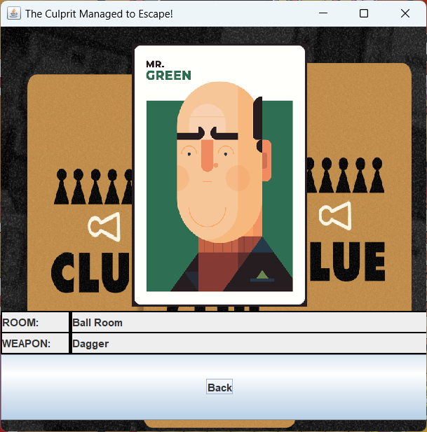

> # Clue/Cluedo Clone
A modified version of the board game Clue/Cluedo using Java Swing and Java AWT

> ## Start Screen

The player may click on the screen to start the game.

> ## Main Menu

The player may choose to play in one of three difficulties: Easy, Medium, Hard. Instructions on how to play is also provided, along with save/load functionalities.

> ## Gameplay

The player may choose to enter the rooms by clicking on the labels.

All gathered clues will be compiled into the detective sheet where the player may review it anytime during gameplay.

When the player has enough clues, they may choose to deduce and pick the room, weapon, and killer.

A wrong guess eliminates a person card.

A correct guess grants the player a win.

If all but one person cards are eliminated, and the remaining card is the killer, the player loses. 

